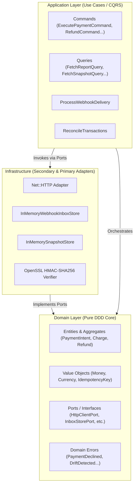
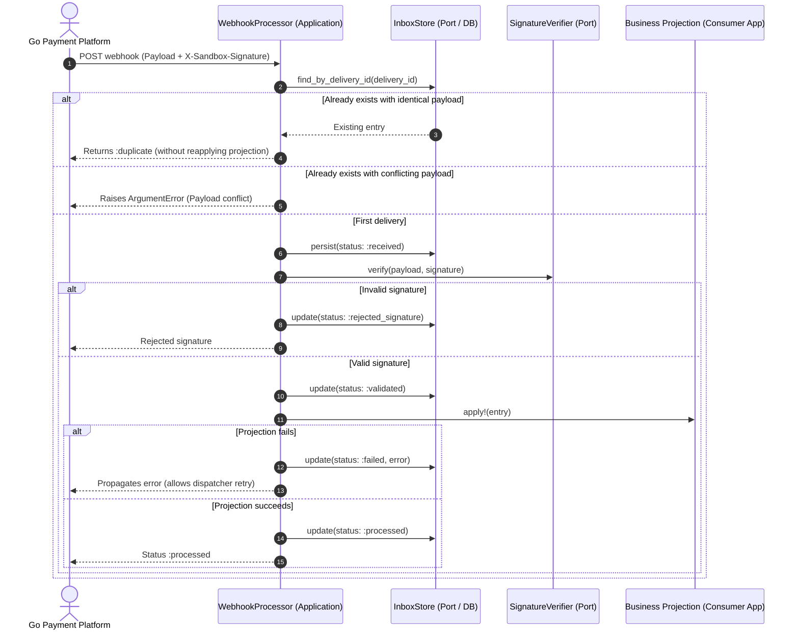

# SDK Architecture (`Payment::SDK`)

This document outlines the architectural guidelines for the `Payment::SDK` Ruby gem, applying **Clean Architecture**, **Hexagonal Architecture (Ports & Adapters)**, **Domain-Driven Design (DDD)**, and **CQRS (Command-Query Responsibility Segregation)**.

---

## 1. Core Principles

### 1.1. Clean & Hexagonal Architecture (Ports & Adapters)
- **Framework & Runtime Independence**: The core domain has zero dependencies on Rails, Sinatra, or third-party HTTP clients (Faraday, HTTParty). It uses pure Ruby (`frozen_string_literal: true`).
- **Ports (Abstract Interfaces / Contracts)**:
  - `HttpClientPort`: Contract for executing HTTP requests (`method`, `path`, `headers`, `body`, `query_params`, `timeout`, `retries`).
  - `InboxStorePort`: Contract to persist and query incoming webhook deliveries before applying mutations.
  - `SnapshotStorePort`: Contract to store reconciliation run outcomes.
  - `MismatchReporterPort`: Contract to alert or log discrepancies without mutating transactional business state.
  - `SignatureVerifierPort`: Contract to verify cryptographic signatures.
- **Adapters**:
  - `Adapters::Http::NetHttpAdapter`: Built on Ruby standard library `net/http` with SSL support, configurable timeouts, and exponential retries.
  - `Adapters::Persistence::InMemoryInboxStore`: Default in-memory implementation for testing and simple environments.
  - `Adapters::Persistence::InMemorySnapshotStore`: Default in-memory implementation for reconciliation results.
  - `Adapters::Crypto::HmacSha256Verifier`: Cryptographic verification using `openssl` with constant-time comparison (`OpenSSL.fixed_length_secure_compare` / `Rack::Utils.secure_compare`).

---

## 2. Domain-Driven Design (DDD)

- **Entities & Aggregates**:
  - `PaymentIntent`: Encapsulates payment lifecycle (`requires_payment_method`, `requires_confirmation`, `requires_capture`, `processing`, `succeeded`, `canceled`).
  - `PaymentAttempt`: Specific execution attempt for an intent.
  - `Charge`: Captured transaction associated with an intent.
  - `Refund`: Partial or total refund issued on a charge.
  - `WebhookEvent`: Event emitted by the platform containing `event_id`, `event_type`, `data`, and `created_at`.
- **Value Objects**:
  - `Money`: Integer cent amounts to prevent floating-point inaccuracies.
  - `Currency`: Normalized 3-letter ISO code (e.g., `USD`).
  - `IdempotencyKey`: Non-empty validated string for state-mutating requests.
  - `Signature`: Hex digest and timestamp for security verification.
- **Domain Invariants**:
  - Every mutating request requires a non-empty `Idempotency-Key` header.
  - Webhooks must be persisted to the Inbox in `:received` status before any projection or business mutation is executed.
  - Reconciliation is strictly read-only and must never modify transactional state.

---

## 3. CQRS (Command & Query Responsibility Segregation)

Mutations (Commands) and inspections (Queries) are strictly segregated:

### 3.1. Commands (State-Mutating Operations)
All commands require an `Idempotency-Key` and produce state changes:
- `CreatePaymentIntentCommand`: Initializes an intent on the platform.
- `ConfirmPaymentIntentCommand`: Confirms the intent with a payment method.
- `CapturePaymentIntentCommand`: Captures authorized funds.
- `CreateRefundCommand`: Issues a refund on an existing charge.

### 3.2. Queries (Read-Only Inspection Operations)
Pure, idempotent HTTP `GET` requests without side effects or idempotency key requirements:
- `GetPaymentIntentQuery`: Retrieves the current intent state.
- `GetPaymentLifecycleQuery`: Fetches state transitions and audit history.
- `GetPaymentAttemptQuery`: Retrieves attempt details.
- `GetChargeQuery`: Retrieves charge details.
- `GetRefundQuery`: Retrieves refund details.
- `GetTransactionReportQuery`: Canonical transaction report (`/v1/reports/transactions`).
- `GetTransactionSnapshotQuery`: Deterministic export for diffing (`/v1/reports/transactions?view=snapshot`).

---

## 4. Inbox Pattern (Resilient Webhook Processing)

---

## 5. Reconciliation Engine (Drift Detection)

The engine reconciles local consumer projections against the Go platform's transaction snapshot:
- **Comparable Fields**: `status`, `latest_attempt_id`, `charge_id`, `amount`, `captured_amount`, `refunded_amount`, `currency`.
- **Drift Types**:
  - `:status_drift`: Mismatched transaction status.
  - `:attempt_drift`: Mismatched latest attempt ID.
  - `:capture_drift`: Mismatched captured amount.
  - `:refund_drift`: Mismatched refunded amount.
  - `:amount_drift`: Mismatched initial amount.
  - `:missing_local`: Record present in the remote snapshot but absent locally.
  - `:missing_remote`: Record present locally but absent in the remote snapshot.
- **Reporting Boundary**: Detected mismatches are stored in `SnapshotStore` and reported via `MismatchReporter` for auditing, without modifying local business records.
